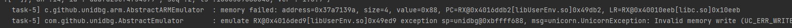
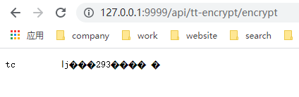

### application.yml 讲解

```yaml
server:
  # 端口
  port: 9999

application:
  unidbg:
    # 是否启用 dynarmic 引擎
    dynarmic: false
    # 是否打印jni调用细节 vm.setVerbose()
    verbose: false
    # 是否使用异步多线程,默认值为true，如果false则改成加锁单线程调用
    async: true

# 多线程相关
spring:
  task:
    execution:
      pool:
        allow-core-thread-timeout: true
        # 8个核心线程
        core-size: 8
        # 超过多久没用的线程自动释放
        keep-alive: 60s
        # 最多增长到多少线程
        max-size: 8
```

### 如何灵活使用 Git 玩出花样

为嘛加这部分与 unidbg 无关的文档，是因为一个看着比较惨痛的 issues  
[打包的时候，一不小心没跳过TEST，直接就把所有代码给功亏一篑了](https://github.com/anjia0532/unidbg-boot-server/issues/5)

#### 添加自己个人库

git clone 下来后，默认我的库是 origin  可以用 `git branch -r` 来查看，`origin/main` 就是我的了，可以通过 `git pull` 来更新

`git remote add myrepo https://github.com/xxx/xxx.git`

后边有改动了，就可以推到自己的库里。

建议使用 idea 的 UI 来操作，参考 <https://www.jetbrains.com/idea/guide/tutorials/creating-a-project-from-github/adding-updating-remotes/>
嫌TM英文看不懂的，建议你装个翻译软件。

#### 提交代码
参考 <https://www.jetbrains.com/help/idea/commit-and-push-changes.html>

#### 不想/不会用 Git，则使用本地历史变更

参考 <https://www.jetbrains.com/help/idea/local-history.html>

#### 回滚变更

参考 <https://www.jetbrains.com/help/idea/undo-changes.html>

#### 如何优雅的抄别人的作业

花式求大佬本地 Commit 变更，然后让他导出 补丁(patch) ，你直接导入即可无痛抄作业了。

参考 <https://www.jetbrains.com/help/idea/using-patches.html>


### Worker多线程运行内存报错问题



修改配置文件`application*.yml`的 `application.unidbg.async` 为`false`，则改成单线程加锁运行

### docker运行报 sh: /entrypoint.sh: not found

打开 `src/main/docker/jib/entrypoint.sh` 查看右下角换行符是`LF`还是`CRLF` ,需要改成`LF`

简单判断

`docker run -it your_docker_hub_password/unidbg-boot-server vi /entrypoint.sh` 注意看最后的`^M`

```bash
#!/bin/sh^M
^M
java ${JAVA_OPTS:''} \^M
-Djava.security.egd=file:/dev/./urandom \^M
-cp /app/resources/:/app/classes/:/app/libs/* "com.anjia.unidbgserver.UnidbgServerApplication"^M
```

### 打印native地址，so文件名，出入参
参考  `src/test/java/com/anjia/unidbgserver/RegisterNativeTest.java`

### PrintUtils打印工具类的用法
```java

import static com.anjia.unidbgserver.utils.PrintUtils.*;

// PrintUtils.printFileResolve 用法
@SneakyThrows @Override
public FileResult resolve(Emulator emulator, String pathname, int oflags) {
    // 打印    
    printFileResolve(pathname); // 也可以使用 printFileResolve(pathname,"/path/to/apk/dir/"); 
    // 其他逻辑
    return null;
}

// 会打印出类似代码，可以直接复制到代码里用
//        case "/data/app/xxxxx==/base.apk": {
//            return FileResult.success(new SimpleFileIO(oflags, TempFileUtils.getTempFile("/path/to/apk/dir/"), pathname));
//        }

// PrintUtils.printArgs
@Override 
public long callStaticLongMethodV(BaseVM vm, DvmClass dvmClass, String signature, VaList vaList) {
    printArgs(vm,"callStaticLongMethodV", signature, vaList);
    // 其他逻辑
    return super.callStaticLongMethodV(vm, dvmClass, signature, vaList);
}
// 会打印出类似代码
// 调用方法名: callStaticLongMethodV,方法签名:XX->xx,参数:0,类型:xxx,值:xxx,参数:1,类型:bb,值:bb
```
**注意：** 需要修改 `logback-spring.xml` 中 `com.anjia.unidbgserver.utils.PrintUtils`为`DEBUG`

### 访问demo返回乱码

正常，因为demo返回的是 `byte[]` 数组，没有对其进行处理 

### 如何进行单元测试

传统的办法是在一个大类里写各种main函数，每次改了都注释，或者写多个main函数，来回改名字。其实不用这么麻烦，用单元测试就可以了。

具体可以参考  `src/test/java/com/anjia/unidbgserver/service`  下的

- `TTEncryptServiceTest.java` 基本等同于main启动 ,可以测试业务流程也可以测试多线程代码

`@Test` 可以简单理解成一个个mian函数，可以直接运行的

`@BeforeEach` 是不管起哪个 `@Test` 方法都会先执行 带`@BeforeEach`

### 修改日志等级

正常运行的，修改 `src/main/resources/logback-spring.xml` 里的

单元测试的，修改 `src/test/resources/logback-test.xml` 里的

### 服务挂掉后如何自动重启

群里有朋友反馈服务运行后会自动挂掉，我没有遇到也没有复现，但是针对这个问题，可以换个思路，将保证服务不挂掉，改成，即使服务挂掉，如何快速自动重启

基于此，给出跨平台的几种方案

跨平台的方案使用docker,支持windows/mac/linux (如何安装docker 参考docker官方文档 https://docs.docker.com/engine/install/)

```bash
docker run --restart=always -d -p9999:9999 anjia0532/unidbg-boot-server
```

windows 下可以用 [nssm](http://www.nssm.cc/download),
参考 [nssm 在windows上部署服务](https://www.cnblogs.com/hai-cheng/p/8670395.html)

linux和mac os 下可以用 Supervisor 参考 [Supervisor-java守护进程工具](https://blog.csdn.net/fuchen91/article/details/107086802/)

### 打包后无法访问文件，报 java.io.FileNotFoundException

以demo里的为例 https://github.com/anjia0532/unidbg-boot-server/blob/main/src/main/java/com/anjia/unidbgserver/service/TTEncrypt.java#L61

把二进制文件 libttEncrypt.so 放到 `src/resources/data/apks/so/` 下, 然后调用`TempFileUtils.getTempFile(LIBTT_ENCRYPT_LIB_PATH)` (
将classpath下的文件copy到临时目录里，后边访问临时目录的即可。)

**为啥不直接写死绝对路径，一旦换机器部署，就要重新修改源代码，重新打包，尤其是把代码分发给网友时，很容易踩坑报错。**

```java

private final static String LIBTT_ENCRYPT_LIB_PATH="data/apks/so/libttEncrypt.so";

vm.loadLibrary(TempFileUtils.getTempFile(LIBTT_ENCRYPT_LIB_PATH),false);
```
idea运行正常，java -jar 运行访问`unidbg-android-0.9.0.jar!/android/sdk23/proc/stat`报错

```bash
java.lang.IllegalStateException: find failed: jarPath=/target/unidbg-boot-server-0.0.1-SNAPSHOT.jar, name=BOOT-INF/lib/unidbg
-android-0.9.0.jar!/android/sdk23/proc/stat
        at com.github.unidbg.utils.ResourceUtils.findJarEntry(ResourceUtils.java:134)
        at com.github.unidbg.utils.ResourceUtils.isFile(ResourceUtils.java:108)
        at com.github.unidbg.utils.ResourceUtils.extractResource(ResourceUtils.java:19)
        at com.github.unidbg.linux.android.AndroidResolver.resolve(AndroidResolver.java:84)
        at com.github.unidbg.unix.UnixSyscallHandler.resolve(UnixSyscallHandler.java:89)
        at com.github.unidbg.unix.UnixSyscallHandler.open(UnixSyscallHandler.java:273)
        at com.github.unidbg.linux.ARM32SyscallHandler.openat(ARM32SyscallHandler.java:1883)
        at com.github.unidbg.linux.ARM32SyscallHandler.hook(ARM32SyscallHandler.java:389)
        at com.github.unidbg.arm.backend.UnicornBackend$6.hook(UnicornBackend.java:244)
        at unicorn.Unicorn$NewHook.onInterrupt(Unicorn.java:128)
        at unicorn.Unicorn.emu_start(Native Method)
        at com.github.unidbg.arm.backend.UnicornBackend.emu_start(UnicornBackend.java:269)
        at com.github.unidbg.AbstractEmulator.emulate(AbstractEmulator.java:382)
        at com.github.unidbg.AbstractEmulator.eFunc(AbstractEmulator.java:471)
        at com.github.unidbg.arm.AbstractARMEmulator.eInit(AbstractARMEmulator.java:227)
        at com.github.unidbg.linux.AbsoluteInitFunction.call(AbsoluteInitFunction.java:38)
        at com.github.unidbg.linux.LinuxModule.callInitFunction(LinuxModule.java:102)
        at com.github.unidbg.linux.AndroidElfLoader.loadInternal(AndroidElfLoader.java:180)
        at com.github.unidbg.linux.AndroidElfLoader.loadInternal(AndroidElfLoader.java:35)
        at com.github.unidbg.spi.AbstractLoader.load(AbstractLoader.java:208)
        at com.github.unidbg.linux.android.dvm.BaseVM.loadLibrary(BaseVM.java:266)
        at com.anjia.unidbgserver.service.TTEncryptService.<init>(TTEncryptService.java:73)
        at com.anjia.unidbgserver.service.TTEncryptServiceWorker.<init>(TTEncryptServiceWorker.java:48)
        at com.anjia.unidbgserver.service.TTEncryptServiceWorker.lambda$new$0(TTEncryptServiceWorker.java:37)
        at com.github.unidbg.worker.DefaultWorkerPool.run(DefaultWorkerPool.java:44)
        at java.lang.Thread.run(Thread.java:748)

```
改成[docker打包部署](README.md#docker打包)就可以了，可能是unidbg访问spring boot打包的fatjar的文件资源有兼容性问题。

### 高并发请求

参考 `com.anjia.unidbgserver.web.TTEncryptController` 和 `com.anjia.unidbgserver.service.TTEncryptService`
和 `com.anjia.unidbgserver.service.TTEncryptServiceWorker` 和 `com.anjia.unidbgserver.service.TTEncryptServiceTest`

主要unidbg模拟逻辑在 `com.anjia.unidbgserver.service.TTEncryptService` 里

`com.anjia.unidbgserver.web.TTEncryptController` 是暴露给外部http调用的

`com.anjia.unidbgserver.service.TTEncryptServiceWorker` 是用多线程包装了一层业务逻辑

`com.anjia.unidbgserver.service.TTEncryptServiceTest` 是单元测试

### 修改日志等级

修改 `logback-spring.xml`

例如 `<logger name="com.github.unidbg" level="WARN"/>`,意味着 `com.github.unidbg` 包 及该包名空间以下的只打印`WARN`和`ERROR`

### 升级spring boot或者unidbg版本

修改`pom.xml`

```xml
<?xml version="1.0" encoding="UTF-8"?>
<project xmlns="http://maven.apache.org/POM/4.0.0" xmlns:xsi="http://www.w3.org/2001/XMLSchema-instance"
         xsi:schemaLocation="http://maven.apache.org/POM/4.0.0 https://maven.apache.org/xsd/maven-4.0.0.xsd">
    <!-- 忽略其他部分 -->
    <parent>
        <groupId>org.springframework.boot</groupId>
        <artifactId>spring-boot-starter-parent</artifactId>
        <!-- spring boot版本号 -->
        <version>2.5.3</version>
        <relativePath/>
    </parent>
    <!-- 忽略其他部分 -->
    <properties>
        <!-- 改成unidbg的版本号 -->
        <unidbg.version>0.9.4</unidbg.version>
        <!-- 忽略其他部分 -->
    </properties>
    <!-- 忽略其他部分 -->
</project>
```

### UnidbgServer运行一段时间后拒绝服务或无响应

这一般是用到了unidbg 或者 unicorn 高级特性，或者是写的 unidbg 模拟代码有问题，不是 unidbg server 本身原因导致的。

一般会有人说，我之前没用 unidbg server 时，写了个 jar ,每次调用都好好的，换了 unidbg server 后才出现的这个问题。。。废话，你写了个 unidbg jar 每次调用，相当于每次重新创建jvm，解析apk或者so重新初始化，每次都是新的，可不没事嘛。unidbg server 是启动时初始化一次后，后边一直在复用。

加上 unidbg 本身对于多线程支持不是很好，很容易导致遇到锁问题，或者线程/内存泄露问题。

而且一般用 unidbg 搞的都 TM 敏感资源，我想替你定位问题，先不说你舍不舍得把源码发我，我 TM 还怕不小心进去呢。

所以，这事，只能内部处理（自己会 java， 团队内部有会 java 的次之，认识靠谱的会 java 的也行）。

补充两个神器，辅助定位问题

- [arthas -- Java定位问题神器](https://arthas.aliyun.com/doc/)
- [arthas-idea-plugin -- idea 的 arthas 插件](https://www.yuque.com/arthas-idea-plugin)

另外补充两个办法（不指标也不治本，试试呗，又不会怀孕，万一有用呢）

- 尝试去掉多线程，改用单线程试试 [Worker多线程运行内存报错问题](#Worker多线程运行内存报错问题)
- 尝试写个全局变量，外部每调用N次后，重新初始化apk/so
