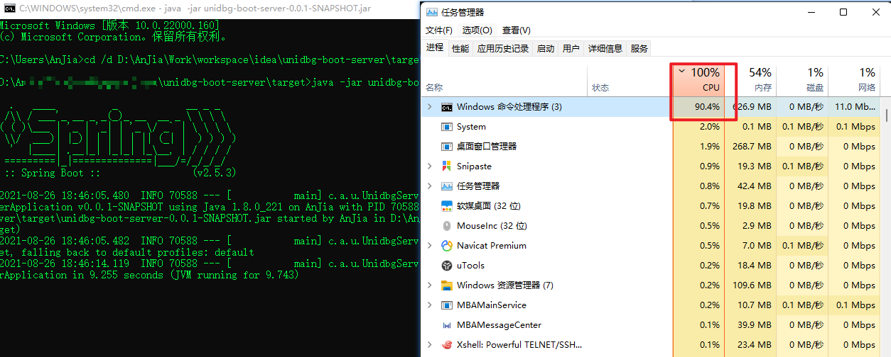

# 基于unidbg0.9.7和spring boot 2.6.3开发的高并发server服务器

## 重要说明

- [关于是否开源基于Jnitrace日志补环境代码说明](https://github.com/anjia0532/unidbg-boot-server/issues/1)
- [常见问题 -- 遇到问题先看看这里有没有，再提问，心累](QA.md) 
- [unidbg-boot-server零基础入门](https://juejin.cn/post/7025794546655035422)
- [指定版本自动编译葫芦娃frida strongR-frida-android](https://github.com/anjia0532/strongR-frida-android)
- [Worker多线程运行内存报错问题](QA.md#Worker多线程运行内存报错问题)
- [UnidbgServer运行一段时间后拒绝服务或无响应](QA.md#UnidbgServer运行一段时间后拒绝服务或无响应)


## 使用

### 环境准备

1. 必须使用Java8(jdk11或其他版本引发的问题，请自行解决)
2. Maven3.5以上 ，如果电脑没有安装Maven，最简单办法是将下面的 `mvn` 命令替换成 `mvnw`(如果是linux/mac一类的，要替换成`./mvnw`,并且先执行`chmod +x ./mvnw`) ，会自动下载maven 
3. Idea 2021+
4. 需要安装[Lombok插件](https://plugins.jetbrains.com/plugin/6317-lombok)
5. 注意，很多人不会用多线程以及 unidbg 对多线程支持的不好，所以默认禁用多线程，如果需要启用，修改 application.yml 里的 async 为 true

## 快速体验

```bash
git clone https://github.com/anjia0532/unidbg-boot-server.git

# 体验jar版本,打成jar包
mvn package -T10 -DskipTests
# 没有maven就用 mvnw package -T10 -DskipTests (linux等需要用 chmod +x ./mvnw && ./mvnw package -T10 -DskipTests)

java -jar target\unidbg-boot-server-0.0.1-SNAPSHOT.jar

# 体验docker版本
docker run --restart=always -d -p9999:9999 anjia0532/unidbg-boot-server 
```

## 调用

启动成功后会打印类似内容

```bash
----------------------------------------------------------
	应用: 		unidbg-boot-server 已启动!
	地址: 		http://127.0.0.1:9999/
	演示访问: 	curl http://127.0.0.1:9999/api/tt-encrypt/encrypt (linux)
	演示访问: 	http://127.0.0.1:9999/api/tt-encrypt/encrypt (windows: 浏览器直接打开)
	常见问题: 	https://github.com/anjia0532/unidbg-boot-server/blob/main/QA.md
	配置文件: 	[application, application-dev]
----------------------------------------------------------
```

```bash
# GET 方式访问
curl -XGET  http://127.0.0.1:9999/api/tt-encrypt/encrypt

# POST 方式访问
curl -XPOST  http://127.0.0.1:9999/api/tt-encrypt/encrypt
```

## 压测

在我个人开发电脑上(`Intel(R) Core(TM) i7-9750H CPU @ 2.60GHz   2.60 GHz`,`32.0 GB (31.9 GB 可用)`,`win 11 64位`)，压测结果是每秒4003.10次(QPS 4003.10) ，wrk相关教程，可以参考 [HTTP压测工具之wrk](https://www.jianshu.com/p/ac185e01cc30)

```
[root@wrk]# docker run --rm  williamyeh/wrk -t12 -c400 -d30s http://127.0.0.1:9999/api/tt-encrypt/encrypt
Running 30s test @ http://127.0.0.1:9999/api/tt-encrypt/encrypt
  12 threads and 400 connections
  Thread Stats   Avg      Stdev     Max   +/- Stdev
    Latency   105.55ms   68.17ms 982.93ms   94.97%
    Req/Sec   341.43     55.05   460.00     80.70%
  120432 requests in 30.08s, 14.72MB read
  Socket errors: connect 0, read 0, write 81, timeout 0
Requests/sec:   4003.10
Transfer/sec:    501.09KB
```

瓶颈在cpu上,demo内存基本在400-600M左右，不会随着并发高而暴涨(注意，仅是此demo情况下，具体还是看实际业务复杂度)



### 使用定制化/快照版unidbg

```bash
git clone https://github.com/zhkl0228/unidbg.git
# 自己魔改
cd unidbg
# linux mac windows cmd
mvn clean install -Dgpg.skip=true -Dmaven.javadoc.skip=true -T10
# windows powershell
mvn clean install `-Dgpg.skip=true `-Dmaven.javadoc.skip=true `-T10
```

以最新快照版 `0.9.5-SNAPSHOT` 为例，修改 `unidbg-boot-server/pom.xml` 里的 `<unidbg.version>0.9.4</unidbg.version>`
为 `<unidbg.version>0.9.5-SNAPSHOT</unidbg.version>`

后续java打包或者docker不变

### java 打包

```
# 打包
mvn package -T10 -DskipTests
# 运行
java -jar target\unidbg-boot-server-0.0.1-SNAPSHOT.jar
```

### docker打包

用docker打包是为了避免个人电脑和生产服务器环境不一致导致的启动失败或者各种问题，保证了开发和生产环境的一致性，以及快速安装等需求

如何安装docker 参考docker官方文档 https://docs.docker.com/engine/install/

**注意**

- 如果是windows的powershell, - 需要改成 `- ,建议windows用cmd
- 将 your_docker_hub_username 换成真实的用户名 ,将 your_docker_hub_password 换成真实的密码

```bash

# 方案1 打包并发布到docker hub
mvn clean package -Djib.to.auth.username=your_docker_hub_username  -Djib.to.auth.password=your_docker_hub_password -Djib.to.image=your_docker_hub_username/unidbg-boot-server  jib:build -Dmaven.test.skip=true --batch-mode -T4

# 方案2 直接打到docker 守护进程里
mvn clean package  -Djib.to.image=your_docker_hub_username/unidbg-boot-server  jib:dockerBuild -Dmaven.test.skip=true --batch-mode -T4

# 方案3 打成docker.tar二进制包
mvn clean package  -Djib.to.image=your_docker_hub_username/unidbg-boot-server  jib:buildTar -Dmaven.test.skip=true --batch-mode -T4
docker load --input target/jib-image.tar

# 在装有docker的机器上运行
sudo docker run  -d -p9999:9999 your_docker_hub_username/unidbg-boot-server 

```

## 感谢

- [zhkl0228/unidbg](https://github.com/zhkl0228/unidbg)

## [常见问题](QA.md)

参见  [QA.md](QA.md)

## 请我喝杯咖啡

如果觉得本项目对你有所帮助，可以请我喝杯咖啡吗？

<table>
    <tr>
        <td ><center>微&nbsp;&nbsp;信</center></td>
        <td ><center>支付宝</center></td>
    </tr>
</table>


